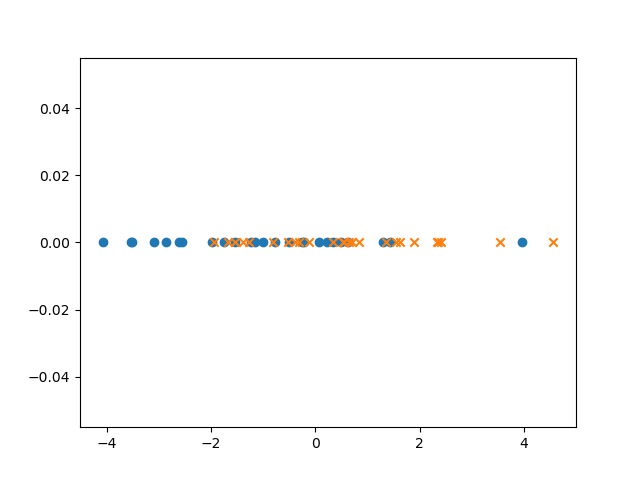

# Classification Based on Probability
The aim of the project is to implement and explore a classifier based on Maximum likelihood.

The maximum likelihood classification only relies on the class conditional probabilities and ignores prior probabilities. 

We will create a one dimensional dataset with two classes using overlapping Gaussian distributions.

*!!! We give you an example output for each function you will create. Since we are using randomly generated data you will not get the exact same results. !!!*

### Section 1

Create a function `gen_data(n, locs, scales)` which returns `n` data points, their classes and a list of classes, using the `rvs` method of the `scipy.stats.norm` object, 
from each normal distributions shifted and scaled by the values in locs and scales, i.e. with a mean and standard deviation given by those arrays.
Enumerate the classes numerically starting from 0.

Example inputs and outputs:
`features, targets, classes = load_data(2, [0, 2], [4, 4])` ->
`([-1.584389672570839, 0.8298584269140962, 1.5171962368458016, -8.269621052957255], [0, 0, 1, 1], [0, 1])`

`gen_data(1, [-1, 0, 1], [2, 2, 2])` ->
`([-1.2790590441258425, 2.3165715702351934, -2.2246392609108434], [0, 1, 2], [0, 1, 2])`

Use this function to create a dataset with a total of 50 samples from two normal distributions: $N(-1, \sqrt{5})$ and $N(1, \sqrt{5})$.
Then create a train and test set using `split_train_test` from `tools.py` with 80% train and 20% test split.

```
(train_features, train_targets), (test_features, test_targets)\
    = split_train_test(features, targets, train_ratio=0.8)
```

### Section 2

Create a plot with all your datapoints colored by class.
You can use `pyplot.scatter` and set a `marker` based on class.

Your plot should look similar to this:



Turn in your plot as `2_1.png`

### Section 3
Create a function `mean_of_class(features, targets, class)` which returns the mean of all features which targets correspond to the given `class`.

Example inputs and outputs:

`mean_of_class(train_features, train_targets, 0)` -> 
`-0.889990579726551`


### Section 4
Create a function `covar_of_class(features, targets, class)` which returns the covariance of features which targets correspond to the given `class`. Take a look at `help.estimate_covariance` for more information on covariance.

Inputs and outputs:
`covar_of_class(train_features, train_targets, 0)` ->
`3.5757079998417667`

### Section 5
Create a function `likelihood_of_class(feature, class_mean, class_covar)` that returns the probability that the feature belongs to the class with the given mean and covariance matrix. To achieve this you should use `scipy.stats.norm.pdf`.

Example inputs and outputs:
```
class_mean = mean_of_class(train_features, train_targets, 0)
class_cov = covar_of_class(train_features, train_targets, 0)
```
`likelihood_of_class(test_features[0:3], class_mean, class_cov)` -> 
`[0.08837893 0.10528978 0.10969852]`

### Section 6
Create a function `maximum_likelihood(train_features, train_targets, test_features, classes)` that:
1. Estimates the mean and covariance of all classes using the training data
2. For each test sample, estimate the likelihoods that the feature belongs to any of the given classes. For $n$ test points and $c$ classes you should return a $[c \times n]$ numpy array.

`maximum_likelihood(train_features, train_targets, test_features, classes)` ->
```
[[0.08837893 0.12472839]
 [0.10528978 0.1305335 ]
 [0.10969852 0.1023002 ]
 [0.10902548 0.12745909]
 [0.09941976 0.1306563 ]
 [0.0516832  0.08190822]
 [0.10969697 0.10229369]
 [0.10174076 0.13101948]
 [0.11047589 0.1243885 ]]
```


### Section 7
Finally create a function `predict(likelihoods)` that, using the given likelihoods, determine a class prediction using

$$\hat{k}_n=\arg \max_k p(\mathbf{x}_n|\mathcal{C}_k)$$

Example inputs and outputs:

```
likelihoods = maximum_likelihood(train_features, train_targets, test_features, classes)
```
`predict(likelihoods)` -> `[1 1 0 1 1 1 0 1 1]`


### Section 8
**Answer this question in a raw text file and submit it as 8_1.txt**

Create a new dataset with 50 datapoints and $N(-4, \sqrt{2})$ and $N(4, \sqrt{2})$.

(Question A) Compare the accuracy of both datasets, if the results are different, what explains the difference?

Play around with the number of datapoints, the mean and standard deviation of the normal distributions.

(Question B) What happens when you change the: 
1. number of datapoints
2. mean of the normal distributions
3. standard deviation of the normal distributions

Explain in a few words how and why each of these affect the accuracy of your model.

### What to turn in to Gradescope
*Read this carefully before you submit your solution.*

You should edit `template.py` to include your own code.
 
This is an individual project, you can of course help each other out but your code should be your own.

You can use built-in python modules as you wish, however you are not allowed to install and import packages other than are already imported.

Files to turn in:

- `template.py`: This is your code
- `2_1.png`
- `8_1.txt`

Make sure the file names are exact. 
Submission that do not pass the first two tests in Gradescope will not be graded.


### Independent Section (optional)
*A rough idea of an independent section idea is listed below. You are free to explore different approaches.*

Do the same on the Iris dataset.
To do this you will need `scipy.stats.multivariate_normal` instead of `scipy.stats.norm`.

You can use load_iris from tools.py to load the dataset and split_train_test to create training and test set:

```
features, targets, classes = load_iris()
(train_features, train_targets), (test_features, test_targets)\
    = split_train_test(features, targets, train_ratio=0.6)
```

Compare your results when using just one of the given properties versus all of them.
What happens when we have more dimensions in the data?
Are some properties more valuable than others? Can a single property outperform any two or more other properties? 
